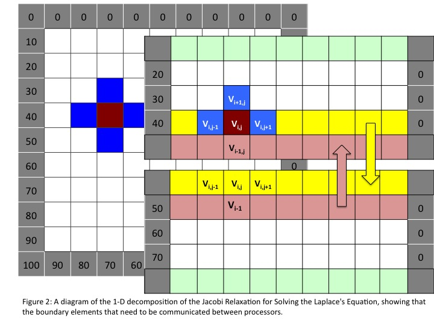

## MPI - 1D Decomposition

Remarks.

1.  The grid matrix is completely distributed, no replicating the
    matrix on all processors. We only use a 1 dimensional decomposition (see
    [Figure 2](#Figure_2)).
    
    
    
2.  The whole process is be parallel, that includes initialization of
    the grid and boundary conditions, the iterative evolution and the final dump on file of the resulting grid. 
