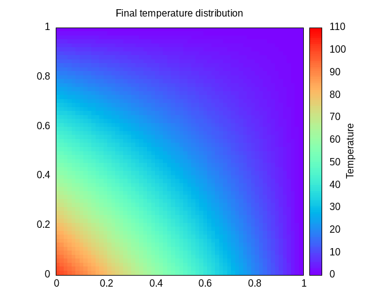

# Numerial solution of the Laplace Equation by Jacobi method
### Background
Please refer to [background](./aux/background.md).

---

### Parallelization
Please refer to [parallelization](./aux/parallel.md).

---

**Dependencies**
- Parallel version requires [**mpi compliant library**](https://www.open-mpi.org/)
- Accelerated version requires [**openacc**](https://www.openacc.org/)
- Plotting requires [**gnuplot**](http://www.gnuplot.info/)
- Creating gif requires [**imagemagick**](https://imagemagick.org/image/wizard.png)

### Compilation
---
To **compile** it is possible to use the command 

```
make [version]
``` 

where `[version]` can be either blank, `mpi` or `openacc`. This will produce the `[version]multiplication.x` executable (the name will depend on which version it has been compiled). 

### Execution
---
The program will initialize the data and run the simulation. To **run** it is possible to use

```bash
make [version]run [prc=%d] [dim=%d] [iters=%d]
```

where `[version]` as above, `[prc=%d]` number of processes, `[dim=%d]` dimension of the grid and `[iters=%d]` iterations of the simulation. This will produce, if necessary, the `[version]multiplication.x` executable (the name will depend on how it has been compiled) and run it. 

### Test
---
To **test** it is possible to pass the `debug=yes` flag while making

```bash
make [version] debug=yes
```

and then run the `[version]multiplication_debug.x` executable using `mpirun`. It is also supported the command:

```bash
make [version]run debug=yes
```

which will compile (if necessary) and run immediately after.

### Other
---
Use:
- `make plot` to see the solution (that is what is obtained after the last iteration)
 
  

- `make clean` and `make flush` to clean up
- `make gif [delay=%d] [frames=%d]` to create GIF

  
