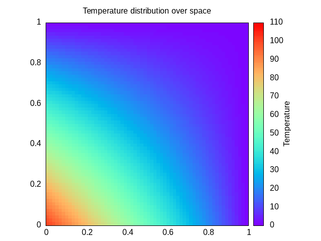

# Numerial solution of the Laplace Equation by Jacobi method
### Background
---
Please refer to [background](./aux/background.md).

### Parallelization
---
Please refer to [parallelization](./aux/hints.md).

**Dependencies**:
- parallel version requies **mpicc**
- plotting requires **gnuplot**
- creating gif requires **imagemagick**

## Compilation
Use:
- `make` to compile serial version
- `make mpi` to compile parallel version

Will produce *jacobi.x* executable.

# Execution
Use:
- `make (mpi)run [dim=%d] [itr=%d] ([prc=%d])` to compile and run (parallel) serial version

Where `dim` dimension of the internal grid, `itr` number of iterations and `prc` number of processes.
Will produce `plot/solution.dat`.

## Plot
Use:
- `make plot` to see the solution

Will produce `plot/result.png`.
Requires `plot/solution.dat` to work properly.

## Other
Use:
- `make clean` to clean up
- `make (mpi)frames [dim=%d] [itr=%d] ([prc=%d]) [frames=%d]` to create `images\*.png` frames using (parallel) serial version
- `make gif [delay=%d]` to create GIF, requires `images\*.png` frames to work properly

Where `frames` number of images produced and `delay` time delay between frames in the GIF.

